

# AEGIS
### Assembly Error Guard & Inspection System
**비전 기반 작업자 오조립 방지 및 공정 검증 시스템**

작업자는 조립하고, AI는 확인한다 — 카메라가 재료 준비부터 조립 완료까지 매 순간 부품의 종류·위치·방향을 검사하고, 
틀리는 즉시 "어디가 왜 틀렸는지" 알려 준다. 모든 판정은 MES로 기록된다.

현대오토에버 모빌리티 SW스쿨 4기 · 스마트팩토리 머신비전 5조 · 2026.09.21 – 09.29

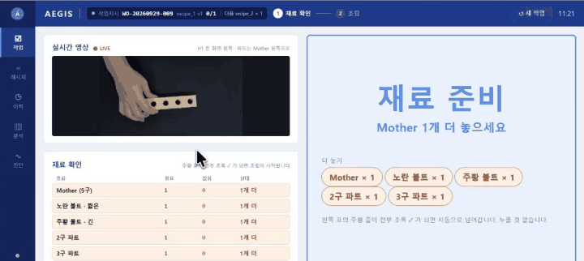

실제 시연 — 재료 확인 → 조립 중 → 오조립 NG → 수정 → PASS (데모 영상 140~194초)

 

| 데이터셋 | 검출 정확도 (mAP50-95) | 오류 사건 검출 | 잘못된 PASS | 처리 속도 |
|:---:|:---:|:---:|:---:|:---:|
| **980장** · 5클래스 | **0.877** (YOLO26n-OBB) | **7 / 7** | **0초** | **25.5 FPS** (GPU) |
| 직접 촬영·라벨링 | 3개 모델 비교 | 재료 2건 · 조립 5건 | 안전측 실패 없음 | 실시간 판정 |

 

## 목차

1. [문제 정의](#1-문제-정의)
2. [해결 방법](#2-해결-방법)
3. [시스템 아키텍처](#3-시스템-아키텍처)
4. [데이터셋](#4-데이터셋)
5. [모델 — 룰베이스와 객체 검출 3종](#5-모델--룰베이스와-객체-검출-3종)
6. [판정 로직 — 상태 머신과 ROI](#6-판정-로직--상태-머신과-roi)
7. [작업자 화면과 MES](#7-작업자-화면과-mes)
8. [공정 평가 결과](#8-공정-평가-결과)
9. [기술 스택](#9-기술-스택)
10. [팀과 역할](#10-팀과-역할)
11. [회고](#11-회고)
12. [문서](#12-문서)

> 설치·실행 방법은 **[docs/getting-started.md](docs/getting-started.md)** 에 따로 정리했다.

---

## 1. 문제 정의

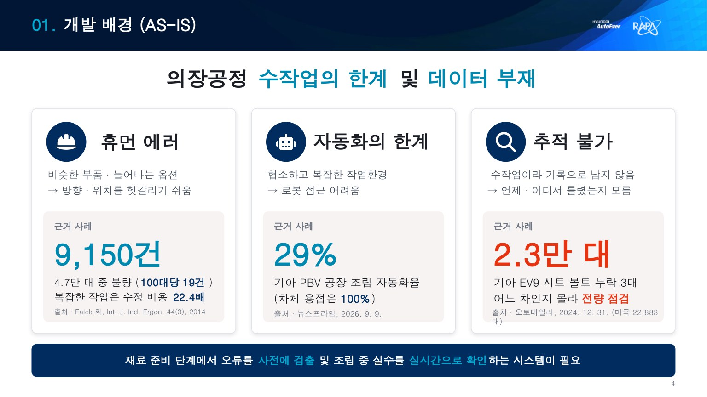

의장(조립) 공정은 아직 사람 손에 크게 의존한다. 기아 PBV 공장도 차체 용접은 100% 자동화됐지만 **조립 자동화율은 29%** 에 그친다.

- **휴먼 에러** — 비슷한 부품, 늘어나는 옵션 때문에 방향·위치를 헷갈리기 쉽다
- **자동화의 한계** — 협소하고 복잡한 작업 환경이라 로봇이 접근하기 어렵다
- **추적 불가** — 수작업은 기록이 남지 않아 언제·어디서 틀렸는지 알 수 없다. 기아 EV9은 시트 볼트 누락 3대 때문에 **2.3만 대를 전량 점검**했다

완성된 뒤에 한 번 검사하는 방식으로는 이미 늦다. **조립하는 도중에** 틀린 순간을 잡아야 한다.

## 2. 해결 방법

**Human–AI Collaboration** — 사람과 AI가 잘하는 일을 나눈다.

| | 기존 | AEGIS |
|---|---|---|
| 검사 시점 | 완성된 뒤 한 번 | 재료 준비 → 조립 중 → 완성, **단계마다 계속** |
| 작업자 | 조립 + 검사 | 조립·수정에만 집중 |
| AI | — | 부품 종류·자리·방향을 계속 확인, 틀리면 위치와 원인을 즉시 안내 |
| 기록 | 없음 | 오류와 수정 과정까지 모두 기록 → 잦은 실수 분석, 불량 시점·범위 추적 |

카메라는 **사람이 아니라 부품만 본다.** 손 추적을 쓰지 않고, 작업대 위 부품 구성이 레시피와 맞는지를 매 프레임 검사한다.

---

## 3. 시스템 아키텍처

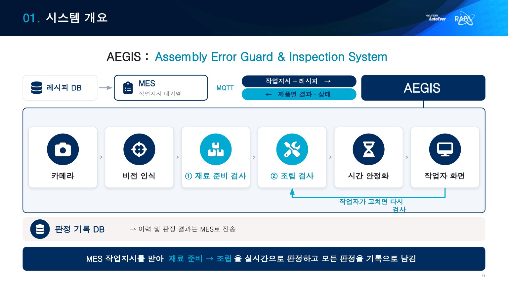

MES가 작업지시를 MQTT로 내려 보내면, 검사대가 그 레시피로 **재료 준비 검사 → 조립 검사**를 실시간으로 판정하고 결과를 다시 MES로 올린다.

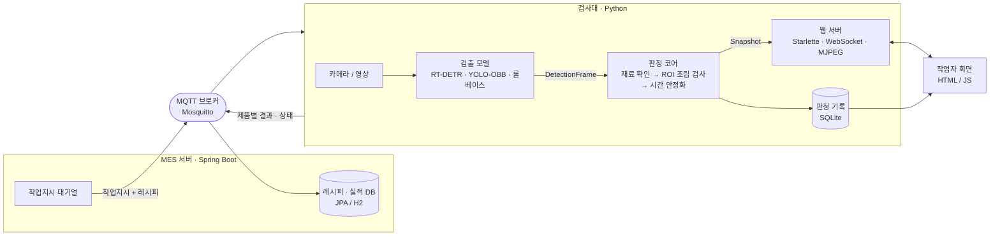
```mermaid
flowchart LR
    subgraph MES["MES 서버 · Spring Boot"]
        WO["작업지시 대기열"]
        RDB[("레시피 · 실적 DB<br/>JPA / H2")]
    end
    BROKER(["MQTT 브로커<br/>Mosquitto"])
    subgraph STATION["검사대 · Python"]
        CAM["카메라 / 영상"] --> DET["검출 모델<br/>RT-DETR · YOLO-OBB · 룰베이스"]
        DET -->|"DetectionFrame"| CORE["판정 코어<br/>재료 확인 → ROI 조립 검사<br/>→ 시간 안정화"]
        CORE -->|"Snapshot"| WEB["웹 서버<br/>Starlette · WebSocket · MJPEG"]
        CORE --> STORE[("판정 기록<br/>SQLite")]
    end
    UI["작업자 화면<br/>HTML / JS"]
    WO -->|"작업지시 + 레시피"| BROKER --> STATION
    STATION -->|"제품별 결과 · 상태"| BROKER --> RDB
    WEB <--> UI
    STORE --> UI
```

**설계 원칙 — 세 계층을 고정된 데이터 계약으로만 잇는다.**

| 계층 | 하는 일 | 계약 |
|---|---|---|
| 검출 (`src/vision/`) | 모델 결과를 공통 형식으로 변환. `--model-type`으로 RT-DETR / YOLO-OBB / 룰베이스 교체 | → `DetectionFrame` |
| 판정 코어 (`src/geometry/`, `src/process/`) | Mother 기준 좌표 → H1~H5 ROI → 부품 연결 → 레시피 비교 → 시간 안정화 | → `Snapshot` |
| UI (`web/`, `scripts/live_inspection.py`) | 같은 `Snapshot`을 웹 또는 OpenCV 창으로 그림 | — |

검출 모델을 바꿔도 판정 로직은 그대로고, UI를 바꿔도 판정 로직은 그대로다. 그래서 같은 영상으로 모델 3종을 공정하게 비교할 수 있었다. 계층별 상세는 [docs/architecture.md](docs/architecture.md).

---

## 4. 데이터셋

<table>
<tr>
<td width="50%">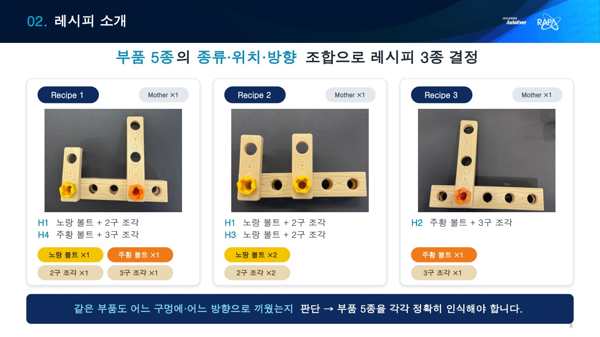</td>
<td width="50%">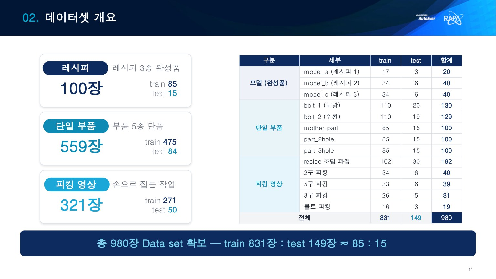</td>
</tr>
</table>

부품 5종(노랑·주황 볼트, 5구 Mother, 3구·2구 파트)을 **어느 구멍에·어느 방향으로** 끼우느냐에 따라 레시피 3종이 정해진다. 그래서 부품 5종을 각각 정확히 구별하는 게 출발점이다.

| 구분 | 내용 | 장수 (train / test) |
|---|---|---|
| 단일 부품 | 검은 배경, 부품 하나씩 위치 랜덤 · 45° 간격 8방향 | 559 (475 / 84) |
| 피킹 영상 | 손으로 집는 실제 작업을 촬영 → 손에 가려진 부품도 인식 | 321 (271 / 50) |
| 완성품 | 레시피 3종 완성 조립체 | 100 (85 / 15) |
| **합계** | | **980 (831 / 149)** |

카메라 높이 42.5 cm 고정, 자동노출 OFF · 셔터 1/17초 · ISO 100, 검은 무광 배경으로 촬영 조건을 통제하고, 조명 ON/OFF · 위치 · 회전 · 손 가림을 바꿔 가며 수집했다.

---

## 5. 모델 — 룰베이스와 객체 검출 3종

### 5-1. 룰베이스 — 딥러닝 없이 구멍 개수로 판정

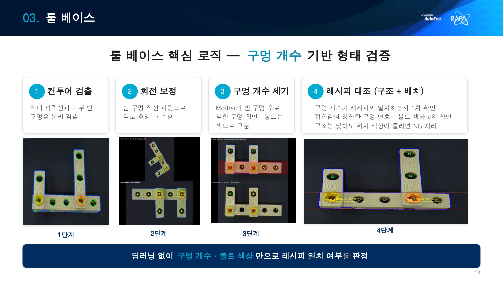

| ① 컨투어 검출 + ③ 구멍 개수 | ② 회전 보정 | ④ 배치 검증 (실제 NG 사례) |
|:---:|:---:|:---:|
| 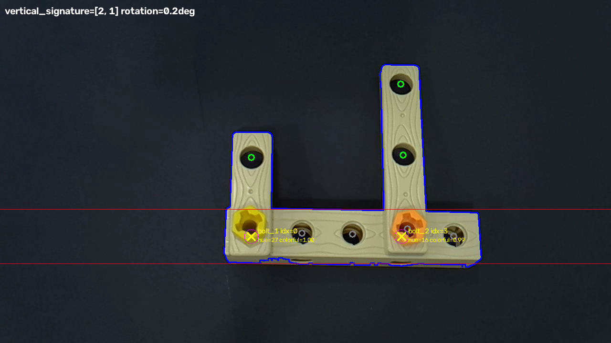 | 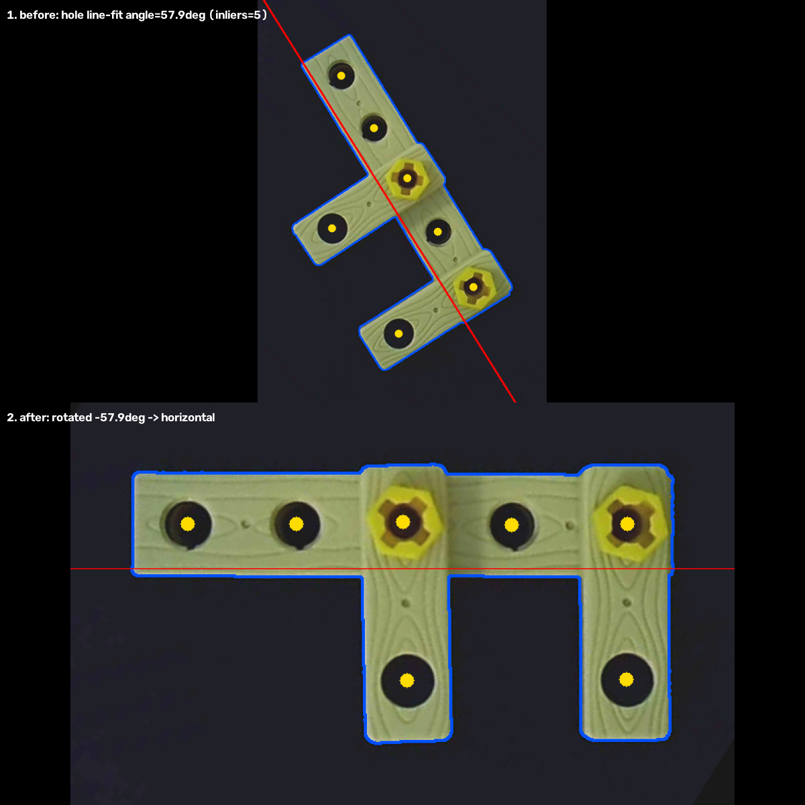 | 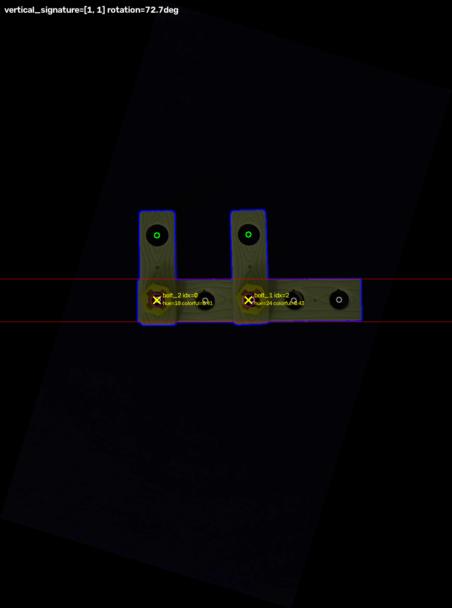 |
| `RETR_CCOMP`로 막대 외곽선과 빈 구멍 분리, 세로 막대별 구멍 수로 모델 판별 | 빈 구멍 중심을 직선 피팅해 각도 추정 → 수평으로 되돌림 (58° 기울어져도 판별) | 구멍 개수는 맞지만 접합 볼트 색이 레시피와 달라 NG |

test 149장 정확도 **81.2%** — 완성품 93.3%, 단일 부품 100%, 손이 나오는 피킹 영상 46%. 나란히 붙은 부품(2구+3구 → 구멍 5개 → Mother로 오인)과 손 가림에 약해서 **딥러닝 검출 모델로 보완**했다. 룰베이스는 모델 없이 도는 검출 모드(`--model-type rule_based`)와, 조립 완료 시점의 완성 형태 교차검증으로 남겼다.

### 5-2. 객체 검출 3종 비교

| 모델 | 방식 | 선정 이유 |
|---|---|---|
| **RT-DETR-L** | Transformer 기반, AABB | NMS 없이 박스를 바로 예측 — CNN 계열(YOLO)과 다른 방식으로 비교 |
| **YOLO11n-OBB** | CNN, 회전 박스 | 검증된 이전 세대 — 개선 폭을 재는 기준선(baseline) |
| **YOLO26n-OBB** | CNN, 회전 박스 | 2026년 1월 공개된 최신 세대 — 구조 개선이 실제 성능 향상으로 이어지는지 검증 |

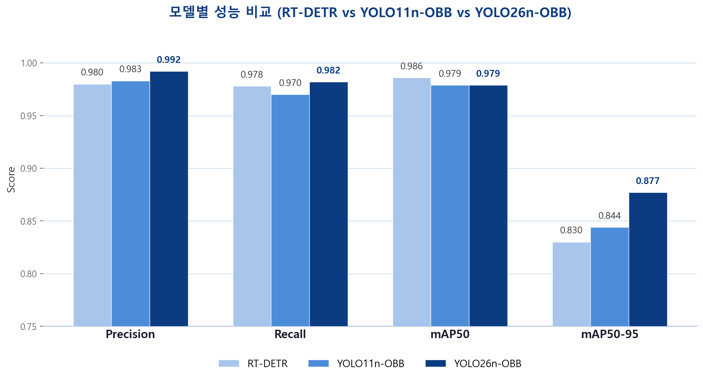

같은 test 149장 기준. **YOLO26n-OBB가 mAP50-95 0.877로 박스 정확도가 가장 높다.** (RT-DETR은 AABB, 두 YOLO는 회전 박스로 채점해서 mAP는 참고 비교)

| 손에 가려져도 검출 (RT-DETR) | | | |
|:---:|:---:|:---:|:---:|
| 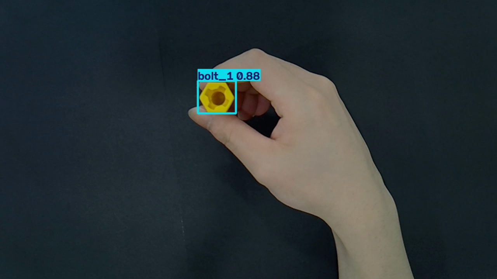 | 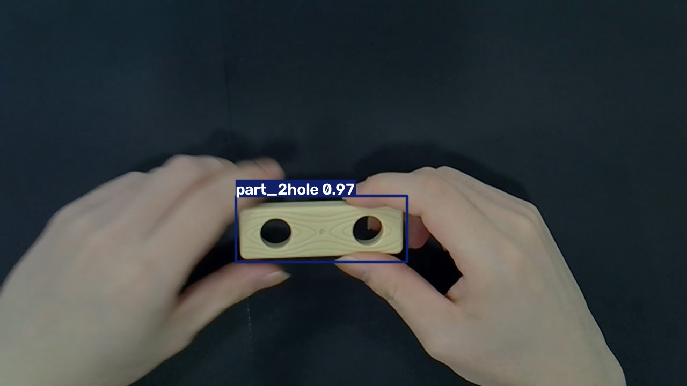 | 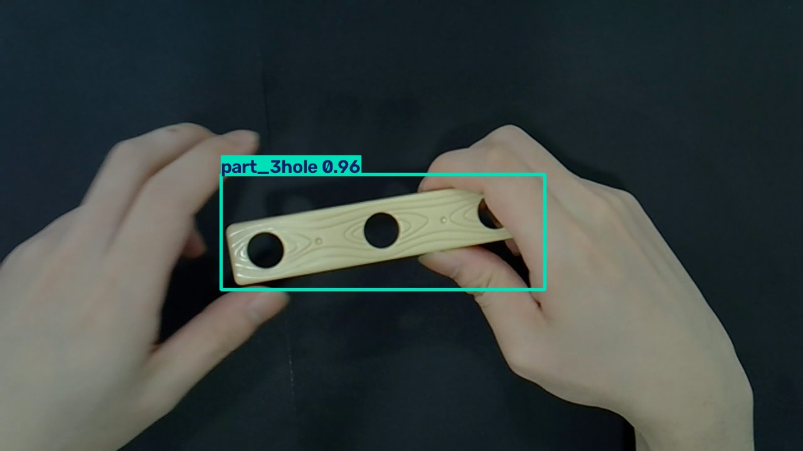 | 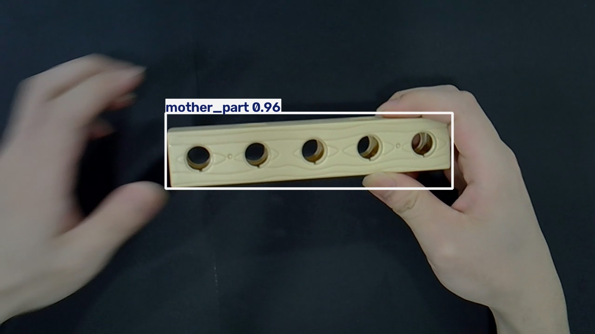 |
| 노랑 볼트 0.88 | 2구 파트 0.97 | 3구 파트 0.96 | Mother 0.96 |

---

## 6. 판정 로직 — 상태 머신과 ROI

<table>
<tr>
<td width="50%">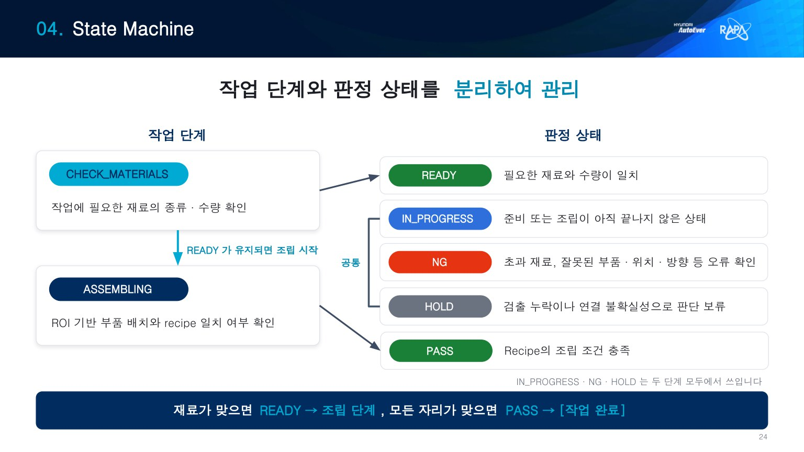</td>
<td width="50%">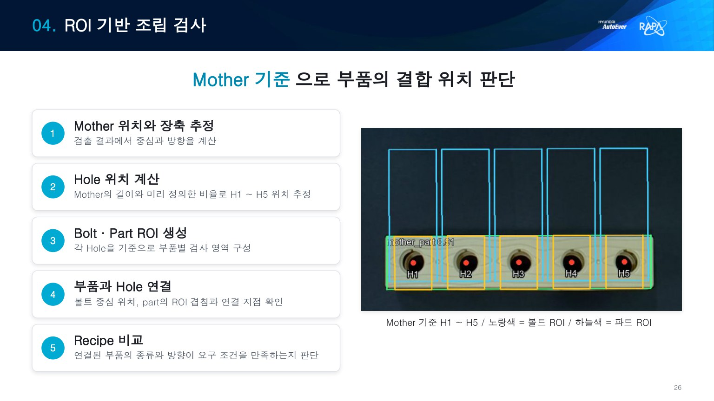</td>
</tr>
</table>

**작업 단계와 판정 상태를 분리해서 관리한다.**

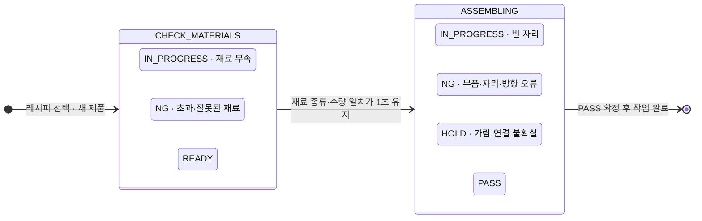
```mermaid
stateDiagram-v2
    direction LR
    [*] --> CHECK_MATERIALS: 레시피 선택 · 새 제품
    CHECK_MATERIALS --> ASSEMBLING: 재료 종류·수량 일치가 1초 유지
    ASSEMBLING --> [*]: PASS 확정 후 작업 완료
    state CHECK_MATERIALS {
        direction LR
        m_wait: IN_PROGRESS · 재료 부족
        m_ng: NG · 초과·잘못된 재료
        m_ready: READY
    }
    state ASSEMBLING {
        direction LR
        a_wait: IN_PROGRESS · 빈 자리
        a_ng: NG · 부품·자리·방향 오류
        a_hold: HOLD · 가림·연결 불확실
        a_pass: PASS
    }
```

1. **재료 준비 검사** — 레시피가 요구하는 부품별 수량을 화면 전체 검출 결과와 비교한다. 부족하면 준비 중, 초과·불필요 재료는 NG. 올바른 구성이 1초 이상 유지되면 조립 단계로 넘어간다.
2. **ROI 조립 검사** — Mother의 중심·장축을 기준으로 H1~H5 구멍 위치를 계산하고, 구멍마다 볼트 ROI(노랑)·파트 ROI(하늘)를 만든다. 볼트 중심과 파트 ROI 겹침으로 부품을 구멍에 연결한 뒤 레시피와 비교한다.
3. **시간 안정화** — 같은 판정이 400 ms 이상 유지돼야 확정한다. 손이 지나가는 순간의 깜빡임으로 판정이 바뀌지 않는다.

| 상태 | 의미 | 예 |
|---|---|---|
| `IN_PROGRESS` | 필요한 자리가 아직 비어 있음 | H4에 볼트를 아직 안 꽂음 |
| `NG` | 잘못된 부품·자리·방향 | H3에 주황 볼트, 파트가 Mother 아래쪽 |
| `HOLD` | 가려지거나 연결 위치가 불명확 → 판정 보류 | 손이 Mother를 덮음 |
| `PASS` | 레시피 조건을 모두 충족 | |

순서는 자유고, 조립체 전체가 180° 돌아가 있어도 정상으로 인정한다(구멍 번호와 위/아래가 같이 뒤집히는지로 진짜 회전과 오조립을 구별). CLI 라이브 검사 앱에서는 PASS가 확정되는 순간 룰베이스 분류기로 완성 형태를 한 번 더 교차검증한다.

| 레시피 | 요구 조립 |
|---|---|
| recipe_1 (Model A) | H1 노랑 볼트 + 2구 파트, H4 주황 볼트 + 3구 파트 |
| recipe_2 (Model B) | H1 · H3 각각 노랑 볼트 + 2구 파트 |
| recipe_3 (Model C) | H2 주황 볼트 + 3구 파트 |

---

## 7. 작업자 화면과 MES

<table>
<tr>
<td width="50%" align="center">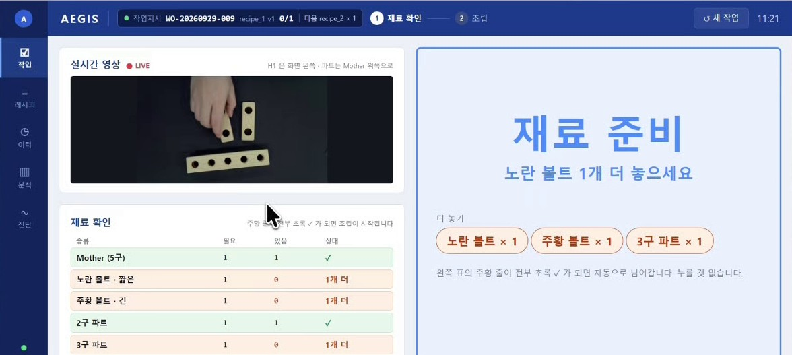 <b>재료 준비</b> — 무엇을 몇 개 더 놓을지 안내</td>
<td width="50%" align="center">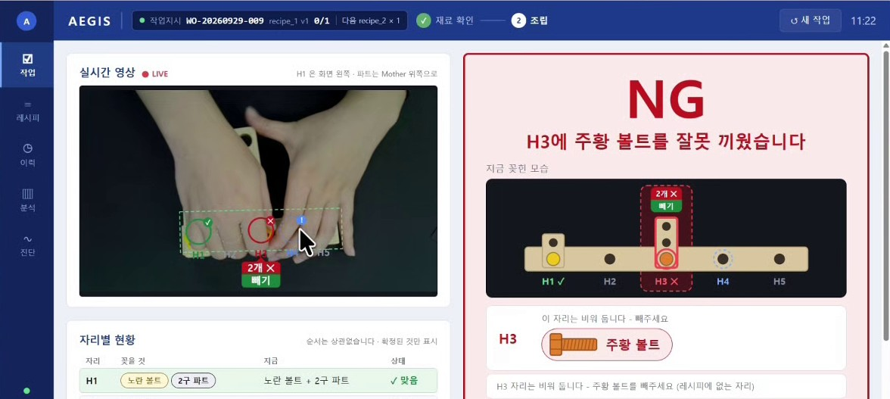 <b>NG</b> — "H3에 주황 볼트를 잘못 끼웠습니다" + 빼야 할 자리 표시</td>
</tr>
<tr>
<td align="center">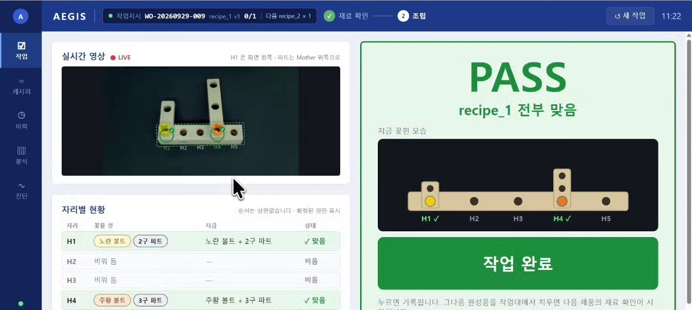 <b>PASS</b> — 레시피 전부 맞음, [작업 완료]로 MES에 실적 보고</td>
<td align="center">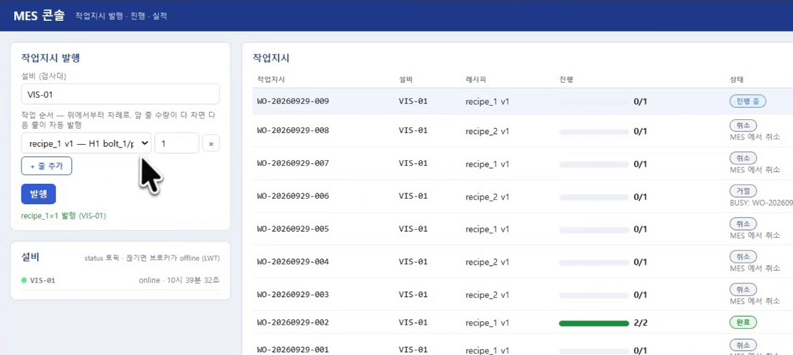 <b>MES 콘솔</b> — 작업지시 발행 · 진행 · 실적</td>
</tr>
<tr>
<td align="center">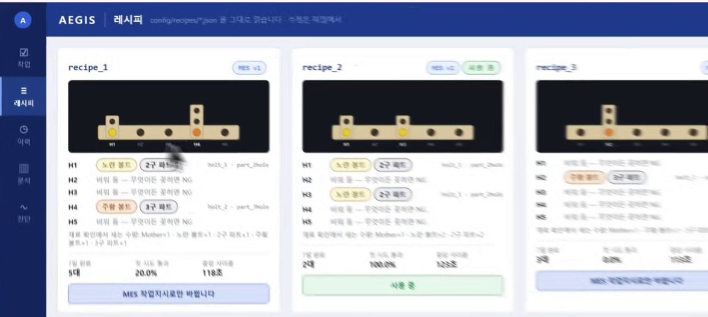 <b>레시피</b> — DB에 저장된 레시피 확인</td>
<td align="center">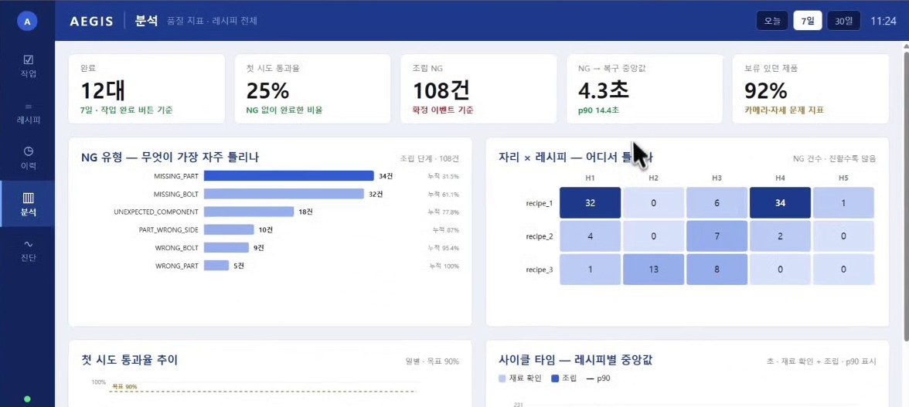 <b>분석</b> — 첫 시도 통과율 · NG 유형 · 자리×레시피 히트맵 · 사이클 타임</td>
</tr>
</table>

- 판정은 프레임이 아니라 **변화만** SQLite에 기록한다(제품 1대에 이벤트 몇 건). 오류 → 수정까지의 과정이 남아서 "어느 자리에서 가장 자주 틀리나"를 바로 볼 수 있다.
- 작업자 ID 컬럼은 두지 않았다. 개인별 실수 통계가 정책이 아니라 **구조상** 불가능하게 했다.
- MES ↔ 검사대는 MQTT(QoS 1, retained 작업지시, LWT로 검사대 온라인 상태). 수량을 다 채우면 MES가 대기열의 다음 작업지시를 자동으로 내려 보낸다.

---

## 8. 공정 평가 결과

검출 정확도(mAP)만으로는 실제 공정에서 잘 동작하는지 알 수 없다. 그래서 **재료 준비부터 조립 완료까지 찍은 3분 47초 영상**을 초 단위로 라벨링(오류 사건 7건: 재료 2 · 조립 5)하고, 모델만 바꿔 같은 영상을 넣어 프레임별 판정을 정답과 비교했다.

<table>
<tr>
<td width="50%">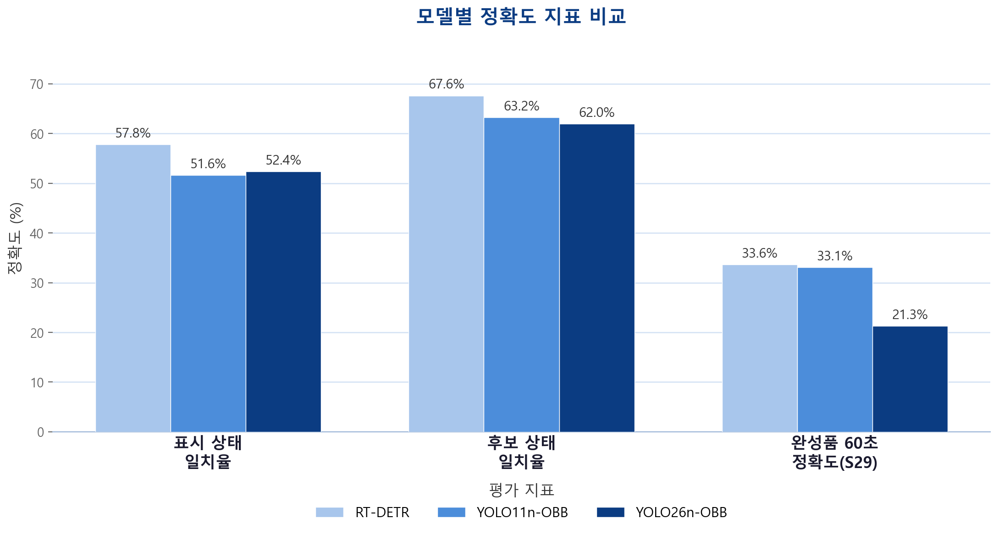</td>
<td width="50%">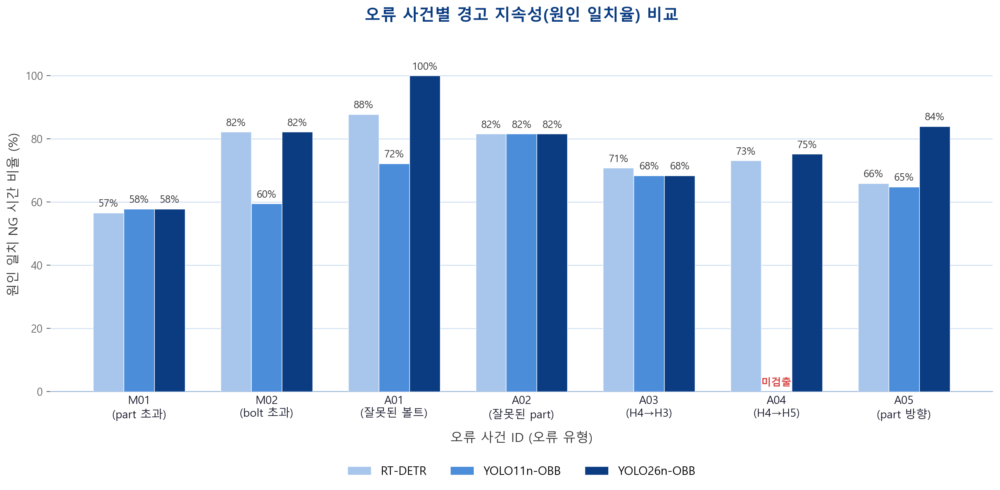</td>
</tr>
<tr>
<td>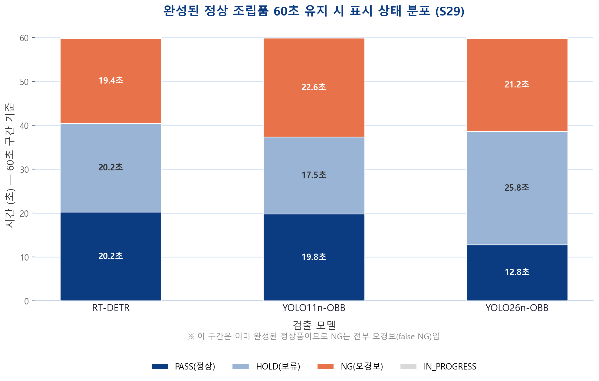</td>
<td>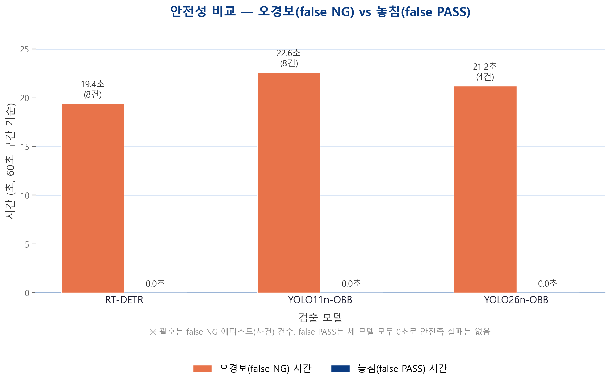</td>
</tr>
</table>

| 지표 | RT-DETR | YOLO11n-OBB | YOLO26n-OBB |
|---|---:|---:|---:|
| 오류 사건 검출 · 원인 일치 | 7/7 | 6/7 (H4→H5 놓침) | **7/7** |
| 표시 상태 일치율 | **57.8%** | 51.6% | 52.4% |
| 정상품 오경보 (false NG) | **19.4초** | 22.6초 | 21.2초 |
| 잘못된 PASS (false PASS) | **0초** | **0초** | **0초** |
| 처리율 (오프라인) | 2.3 FPS · CPU | **25.5 FPS** · GPU | 14.2 FPS · CPU |

- **안전측 실패는 없다** — 세 모델 모두 미완성·오조립을 PASS로 넘긴 시간이 0초다.
- 검출이 가장 견실한 건 YOLO26n-OBB(7/7, 오경보 에피소드 4건으로 가장 적음), 정확도는 RT-DETR이 가장 높지만 CPU에서 2.3 FPS라 GPU가 필수다.
- 실제 시스템은 YOLO26 기준 30 FPS로 실시간성을 확보했다.
- 상세: [docs/comparison_run03_05_06_ko.md](docs/comparison_run03_05_06_ko.md)

---

## 9. 기술 스택

| 영역 | 사용 기술 |
|---|---|
| 검출 모델 | Ultralytics YOLO11n-OBB · YOLO26n-OBB · RT-DETR-L, PyTorch (CUDA) |
| 룰베이스 비전 | OpenCV — Otsu 이진화, `findContours(RETR_CCOMP)`, 원형도 필터, HSV 색상, 직선 피팅 회전 보정 |
| 완성체 분류 | ResNet-18 파인튜닝 (2단계 학습 · Grad-CAM) |
| 판정 코어 | Python — 데이터 계약(`DetectionFrame`/`Snapshot`), 기하·ROI, 상태 머신, 시간 필터 |
| 작업자 화면 | Starlette · Uvicorn, WebSocket · MJPEG 스트리밍, 순수 HTML/CSS/JS |
| 저장 | SQLite — 변화 이벤트만 기록, 이력 · FPY · 파레토 · 히트맵 · 사이클 타임 |
| MES | Spring Boot 3.5 · JPA/H2 · Paho MQTT · Mosquitto |
| 테스트 | pytest 170개 · JUnit 13개 · node UI 테스트 67개 |

---

## 10. 팀과 역할

| 이름 | 역할 | 담당 |
|---|---|---|
| 이태인 | 팀장 | 데이터 수집 · YOLO26n-OBB 학습 · 조립 과정 평가 기본 로직 · 데모 영상 |
| 최승재 | 팀원 | 데이터 수집 · 판정 코어(상태 머신 · 자리 판정) · 조립 과정 평가 로직 고도화 |
| **허민엽** | 팀원 | **룰베이스 · RT-DETR 학습 · 조립 과정 평가 로직 고도화** |
| 최유성 | 팀원 | YOLO11n-OBB 학습 · DB 저장 계층 · 웹 UI(작업자 화면 · 분석) · MES 연동 |

<b>허민엽 — 담당 상세</b>

- **룰베이스 비전 파이프라인** (`src/rule_based/`) — 컨투어·구멍 개수·회전 보정·배치(구멍 번호 + 볼트 색) 검증으로 완성 조립체를 Model A/B/C로 판별. 이를 여러 물체 실시간 검출로 확장한 어댑터(`src/vision/rule_based_adapter.py`, `--model-type rule_based`)
- **RT-DETR-L 실험** (`src/detection/rt-detr/`) — 단일 부품 → 조립체 라벨링 데이터 추가 → 980장 통합까지 3차례 학습, 2구/3구 혼동 문제를 조립체 데이터로 해결. AABB만 나오는 RT-DETR 결과에서 Mother 각도를 영상으로 복원하는 어댑터(`src/vision/rtdetr_adapter.py`). 기록: [docs/rt-detr-experiment.md](docs/rt-detr-experiment.md)
- **라이브 검사 앱** (`scripts/live_inspection.py`) — RT-DETR / YOLO / YOLO-OBB / 룰베이스를 `--model-type` 하나로 교체, 카메라 좌우·상하 반전 보정, PASS 확정 시 룰베이스 최종 교차검증
- **판정 로직 고도화** — 부품이 Mother 아래쪽에 붙은 오조립과 조립체 전체 180° 회전을 구별하는 로직 통합, 위/아래가 섞인 물리적으로 불가능한 조합 차단, 웹 화면의 180° 회전 시 구멍 번호 표시 버그 수정
- **통합** — 웹 UI 브랜치와 판정 로직 브랜치 병합, 전체 아키텍처 문서화

---

## 11. 회고

**잘한 점**
- 룰베이스로 시작해 한계(붙은 부품 · 손 가림)를 수치로 확인하고, 딥러닝 검출 3종을 같은 데이터·같은 영상으로 비교해 선택하는 **근거 있는 엔지니어링 과정**
- 작업 환경을 모사한 **피킹 영상까지 포함한 980장** 자체 데이터셋
- 판정 코어를 검출·UI와 분리해 모델을 바꿔도 같은 판정 로직으로 공정 평가

**아쉬운 점**
- 놓침(false PASS)은 0초로 막았지만, 완성된 정상품을 NG로 오판하는 **오경보가 60초 중 19~23초** 남았다. 세 모델 공통이라 모델보다 연결·기하 판정 안정화 문제로 보고 있다.
- 오프라인 처리율은 실제 카메라 → 경고 지연이 아니다. 실제 지연은 따로 측정해야 한다.

**향후 계획**
- MES/ERP 연동 고도화 — 작업지시 자동 수신, NG 알림, 이력 기반 공정 개선
- 로봇 조립 검증 — 사람이 아닌 로봇의 조립 동작도 같은 비전 검증으로 판정하고 결과를 로봇 제어기에 피드백
- Edge AI 최적화 — 경량화와 추론 속도 개선, 토크·힘 센서와 결합한 물리적 품질 검증

---

## 12. 문서

| 문서 | 내용 |
|---|---|
| [docs/getting-started.md](docs/getting-started.md) | **설치 · 실행 방법** |
| [docs/architecture.md](docs/architecture.md) | 계층 · 데이터 계약 · 파일 맵 |
| [docs/web.md](docs/web.md) · [docs/storage.md](docs/storage.md) | 작업자 화면 · SQLite 저장 계층 |
| [mes/README.md](mes/README.md) · [mes/docs/mes_mqtt.md](mes/docs/mes_mqtt.md) | MES 서버 · MQTT 메시지 규약 |
| [docs/rt-detr-experiment.md](docs/rt-detr-experiment.md) · [docs/detection_obb.md](docs/detection_obb.md) · [docs/classification.md](docs/classification.md) | 모델 학습 · 평가 기록 |
| [docs/video-evaluation.md](docs/video-evaluation.md) · [docs/comparison_run03_05_06_ko.md](docs/comparison_run03_05_06_ko.md) | 영상 기반 공정 평가 방법 · 결과 |
| [docs/state_machine_handoff.md](docs/state_machine_handoff.md) | 판정 코어 API · 출력 |
| [presentation/](presentation/) | 최종 발표자료(PDF) · 발표용 이미지 |
