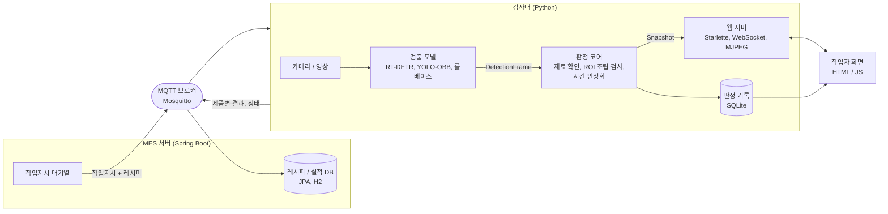
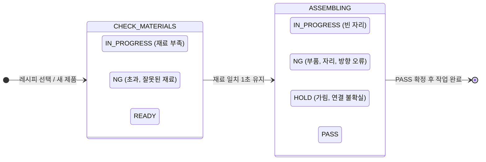

# AEGIS
### Assembly Error Guard & Inspection System

비전 기반 작업자 오조립 방지 및 공정 검증 시스템

현대오토에버 모빌리티 SW스쿨 4기 스마트팩토리 머신비전 5조 (2026.09.21 ~ 09.29)

재료 확인 → 조립 → 오조립 NG → 수정 → PASS 시연 화면

## 프로젝트 요약

- 카메라로 재료 준비부터 조립 완료까지 부품의 종류, 위치, 방향을 실시간 검사
- 잘못 조립하면 틀린 자리와 원인을 작업자 화면에 바로 표시
- MES에서 작업지시를 받고, 제품별 판정 결과를 MES로 보고
- 실행 방법: [docs/getting-started.md](docs/getting-started.md)

| 항목 | 결과 |
|---|---|
| 데이터셋 | 980장, 5클래스 (직접 촬영 및 라벨링) |
| 검출 성능 | YOLO26n-OBB mAP50-95 0.877 |
| 오류 사건 검출 | 7건 중 7건 (재료 2, 조립 5) |
| 미완성품 PASS 오판 | 0초 |
| 처리 속도 | 25.5 FPS (GPU 기준) |

## 목차

1. [개발 배경](#1-개발-배경)
2. [개발 목표](#2-개발-목표)
3. [시스템 아키텍처](#3-시스템-아키텍처)
4. [데이터셋](#4-데이터셋)
5. [모델](#5-모델)
6. [판정 로직](#6-판정-로직)
7. [작업자 화면과 MES](#7-작업자-화면과-mes)
8. [공정 평가 결과](#8-공정-평가-결과)
9. [기술 스택](#9-기술-스택)
10. [팀 구성](#10-팀-구성)
11. [회고](#11-회고)
12. [관련 문서](#12-관련-문서)

## 1. 개발 배경

- 휴먼 에러
  - 비슷한 부품과 늘어나는 옵션으로 방향, 위치 실수가 잦음
- 자동화의 한계
  - 조립 공정은 작업 공간이 좁고 복잡해 로봇 투입이 어려움
  - 기아 PBV 공장 조립 자동화율 29% (차체 용접은 100%)
- 추적 불가
  - 수작업은 기록이 남지 않아 오류 시점과 범위를 알 수 없음
  - 기아 EV9 시트 볼트 누락 3대로 2.3만 대 전량 점검
- 완성 후 검사로는 늦기 때문에 조립 중에 실수를 잡는 시스템이 필요

## 2. 개발 목표

- 작업자는 조립과 수정, AI는 부품 확인으로 역할 분담
- 완성 후 1회 검사가 아닌 재료 준비, 조립 중, 완성 단계별 검사
- 손 추적 없이 작업대 위 부품 구성이 레시피와 맞는지만 판단
- 오류와 수정 과정을 기록해 공정 개선과 불량 추적에 활용

## 3. 시스템 아키텍처

- 처리 흐름
  - MES에서 작업지시와 레시피를 MQTT로 전달
  - 검사대에서 재료 준비 검사 후 조립 검사 수행
  - 제품별 판정 결과와 상태를 MES로 전송
- 계층 구조
  - 검출: 모델 결과를 공통 형식(`DetectionFrame`)으로 변환, `--model-type`으로 모델 교체
  - 판정 코어: Mother 기준 H1~H5 ROI 계산, 부품 연결, 레시피 비교, 시간 안정화 후 `Snapshot` 출력
  - UI: 같은 `Snapshot`을 웹 화면 또는 OpenCV 창으로 표시
  - 계층 간에는 정해진 데이터 형식으로만 통신해 모델이나 UI를 바꿔도 판정 로직은 그대로 유지
- 상세 구조: [docs/architecture.md](docs/architecture.md)

## 4. 데이터셋

<table>
<tr>
<td width="50%"></td>
<td width="50%"></td>
</tr>
</table>

- 부품 5종: 노랑 볼트, 주황 볼트, Mother(5구), 3구 파트, 2구 파트
- 레시피 3종: 같은 부품도 끼우는 구멍과 방향에 따라 레시피가 달라짐
- 촬영 조건
  - 고정: 카메라 높이 42.5cm, 자동노출 OFF, 셔터 1/17초, ISO 100, 검은 무광 배경
  - 변경: 조명 ON/OFF, 위치 랜덤, 45도 간격 8방향 회전, 손 가림 여부

| 구분 | 내용 | 전체 | train | test |
|---|---|---:|---:|---:|
| 단일 부품 | 부품 1개씩 정적 촬영 | 559 | 475 | 84 |
| 피킹 영상 | 손으로 집는 장면, 조립 과정 프레임 | 321 | 271 | 50 |
| 완성품 | 레시피 3종 완성 조립체 | 100 | 85 | 15 |
| 합계 | | 980 | 831 | 149 |

## 5. 모델

### 5-1. 룰베이스

| 컨투어 검출, 구멍 개수 | 회전 보정 | 배치 검증 |
|:---:|:---:|:---:|
|  |  |  |

- 처리 단계
  - `findContours(RETR_CCOMP)`로 막대 외곽선과 빈 구멍 분리
  - 빈 구멍 중심을 직선 피팅해 기울기 추정 후 수평으로 보정
  - 세로 막대별 구멍 개수로 Model A/B/C 판별
  - 접합 구멍 번호와 볼트 색까지 비교해 배치 오류 판정
- test 149장 정확도 81.2%
  - 완성품 93.3%, 단일 부품 100%, 피킹 영상 46%
- 한계
  - 2구와 3구 파트가 붙어 있으면 구멍 5개로 보고 Mother로 오인
  - 손에 가려진 부품은 검출 실패
  - 위 한계를 보완하기 위해 딥러닝 검출 모델 도입
- 현재 활용
  - 모델 없이 동작하는 검출 모드 (`--model-type rule_based`)
  - CLI 검사 앱에서 PASS 확정 시 완성 형태 교차검증

### 5-2. 객체 검출 모델 비교

| 모델 | 방식 | 선정 이유 |
|---|---|---|
| RT-DETR-L | Transformer, 일반 박스 | NMS 없이 박스를 바로 예측, CNN 계열과 비교 |
| YOLO11n-OBB | CNN, 회전 박스 | 검증된 이전 세대 모델, 비교 기준 |
| YOLO26n-OBB | CNN, 회전 박스 | 2026년 1월 공개 최신 모델, 구조 개선 효과 확인 |

- 동일한 test 149장으로 평가
- mAP50-95 기준 YOLO26n-OBB가 가장 높음 (0.877)
- RT-DETR은 일반 박스, YOLO 2종은 회전 박스 기준이라 mAP는 참고용 비교

| 손에 가려진 부품 검출 예시 (RT-DETR) | | | |
|:---:|:---:|:---:|:---:|
|  |  |  |  |
| 노랑 볼트 0.88 | 2구 파트 0.97 | 3구 파트 0.96 | Mother 0.96 |

## 6. 판정 로직

<table>
<tr>
<td width="50%"></td>
<td width="50%"></td>
</tr>
</table>

- 재료 준비 검사
  - 레시피에 필요한 부품별 수량과 화면 전체 검출 결과 비교
  - 부족하면 진행 중, 초과하거나 불필요한 재료는 NG
  - 올바른 구성이 1초 이상 유지되면 조립 단계로 전환
- ROI 조립 검사
  - Mother 중심과 장축으로 H1~H5 구멍 위치 계산
  - 구멍마다 볼트 ROI, 파트 ROI 생성
  - 볼트 중심 위치와 파트 ROI 겹침으로 부품과 구멍 연결
  - 연결된 부품 종류와 방향을 레시피와 비교
- 시간 안정화
  - 같은 판정이 400ms 이상 유지될 때만 확정
  - 손이 지나갈 때 판정이 깜빡이는 문제 방지
- 기타
  - 조립 순서는 자유
  - 조립체 전체가 180도 회전한 경우는 정상으로 인정하고, 부품 하나만 반대쪽에 붙은 경우는 NG

| 상태 | 의미 |
|---|---|
| IN_PROGRESS | 필요한 자리가 아직 비어 있음 |
| NG | 잘못된 부품, 자리, 방향 |
| HOLD | 가림 또는 연결 위치 불명확으로 판정 보류 |
| PASS | 레시피 조건 모두 충족 |

| 레시피 | 요구 조립 |
|---|---|
| recipe_1 (Model A) | H1 노랑 볼트 + 2구 파트, H4 주황 볼트 + 3구 파트 |
| recipe_2 (Model B) | H1, H3 각각 노랑 볼트 + 2구 파트 |
| recipe_3 (Model C) | H2 주황 볼트 + 3구 파트 |

## 7. 작업자 화면과 MES

<table>
<tr>
<td width="50%" align="center"> 재료 준비: 부족한 재료 안내</td>
<td width="50%" align="center"> NG: 잘못 끼운 자리와 원인 표시</td>
</tr>
<tr>
<td align="center"> PASS: 작업 완료 시 MES로 실적 보고</td>
<td align="center"> MES 콘솔: 작업지시 발행, 진행, 실적</td>
</tr>
<tr>
<td align="center"> 레시피 목록</td>
<td align="center"> 분석: 첫 시도 통과율, NG 유형, 자리별 NG 히트맵</td>
</tr>
</table>

- 작업자 화면
  - 실시간 영상 위에 H1~H5 위치와 판정 결과 표시
  - 이력, 분석, 진단 탭 제공
- 판정 기록
  - 프레임 단위가 아닌 판정 변화 이벤트만 SQLite에 저장
  - 오류부터 수정까지의 과정이 남아 자주 틀리는 자리 분석 가능
  - 작업자 ID는 저장하지 않음
- MES 연동
  - MQTT로 작업지시 수신, 결과 및 상태 전송
  - 목표 수량을 채우면 다음 작업지시 자동 수신
  - 검사대 연결이 끊기면 MES 콘솔에 offline 표시

## 8. 공정 평가 결과

- 평가 방법
  - 재료 준비부터 조립 완료까지 3분 47초 영상 촬영
  - 구간별 정답 상태를 초 단위로 라벨링 (오류 사건 7건)
  - 모델만 바꿔 같은 영상을 입력하고 프레임별 판정을 정답과 비교

<table>
<tr>
<td width="50%"></td>
<td width="50%"></td>
</tr>
<tr>
<td></td>
<td></td>
</tr>
</table>

| 지표 | RT-DETR | YOLO11n-OBB | YOLO26n-OBB |
|---|---:|---:|---:|
| 오류 사건 검출 | 7/7 | 6/7 | 7/7 |
| 표시 상태 일치율 | 57.8% | 51.6% | 52.4% |
| 정상품 오경보 시간 | 19.4초 | 22.6초 | 21.2초 |
| 미완성품 PASS 오판 시간 | 0초 | 0초 | 0초 |
| 처리 속도 | 2.3 FPS (CPU) | 25.5 FPS (GPU) | 14.2 FPS (CPU) |

- 세 모델 모두 미완성품이나 오조립을 PASS로 판정한 경우 없음
- YOLO26n-OBB: 오류 사건 7건 모두 검출, 오경보 발생 횟수 4건으로 가장 적음
- RT-DETR: 상태 일치율은 가장 높지만 CPU 2.3 FPS로 실시간 사용에는 GPU 필요
- YOLO11n-OBB: H4→H5 위치 오류 1건 미검출
- 실제 시스템은 YOLO26 기준 30 FPS로 운영
- 처리 속도는 오프라인 측정값이며, RT-DETR과 YOLO26은 CPU, YOLO11은 GPU 환경
- 상세 결과: [docs/comparison_run03_05_06_ko.md](docs/comparison_run03_05_06_ko.md)

## 9. 기술 스택

| 구분 | 기술 |
|---|---|
| 검출 모델 | Ultralytics YOLO11n-OBB, YOLO26n-OBB, RT-DETR-L, PyTorch |
| 룰베이스 | OpenCV (Otsu 이진화, 컨투어, 원형도 필터, HSV 색상 판별) |
| 완성품 분류 | ResNet-18 |
| 판정 코어 | Python |
| 작업자 화면 | Starlette, Uvicorn, WebSocket, MJPEG, HTML/CSS/JS |
| 저장 | SQLite |
| MES | Spring Boot 3.5, JPA, H2, Paho MQTT, Mosquitto |
| 테스트 | pytest 170개, JUnit 13개, node UI 테스트 67개 |

## 10. 팀 구성

| 이름 | 역할 | 담당 |
|---|---|---|
| 이태인 | 팀장 | 데이터 수집, YOLO26n-OBB 학습, 조립 과정 평가 기본 로직, 데모 영상 |
| 최승재 | 팀원 | 데이터 수집, 판정 코어(상태 머신, 자리 판정), 조립 과정 평가 로직 고도화 |
| 허민엽 | 팀원 | 룰베이스, RT-DETR 학습, 조립 과정 평가 로직 고도화 |
| 최유성 | 팀원 | YOLO11n-OBB 학습, DB 저장 계층, 웹 UI, MES 연동 |

## 11. 회고

- 잘한 점
  - 룰베이스의 한계를 수치로 확인한 뒤 딥러닝 모델 3종을 같은 조건에서 비교해 선택
  - 피킹 영상을 포함한 980장 데이터셋 직접 구축
  - 판정 로직을 모델, UI와 분리해 모델만 바꿔 공정 평가 가능
- 아쉬운 점
  - 미완성품 PASS 오판은 0초였지만 정상품을 NG로 판정하는 오경보가 60초 중 19~23초 발생
  - 세 모델 공통 현상이라 모델보다는 부품 연결과 기하 판정 안정화가 필요
  - 처리 속도는 오프라인 측정값으로, 카메라에서 경고까지의 실제 지연은 미측정
- 향후 계획
  - MES/ERP 연동 고도화 (작업지시 자동 수신, NG 알림, 이력 기반 공정 개선)
  - 로봇 조립 결과 검증으로 확장
  - 모델 경량화 및 추론 속도 개선, 토크 센서 등과 결합한 물리 품질 검증

## 12. 관련 문서

| 문서 | 내용 |
|---|---|
| [docs/getting-started.md](docs/getting-started.md) | 설치 및 실행 방법 |
| [docs/architecture.md](docs/architecture.md) | 전체 구조, 데이터 형식, 파일 구성 |
| [docs/web.md](docs/web.md), [docs/storage.md](docs/storage.md) | 작업자 화면, SQLite 저장 |
| [mes/README.md](mes/README.md), [mes/docs/mes_mqtt.md](mes/docs/mes_mqtt.md) | MES 서버, MQTT 메시지 규약 |
| [docs/rt-detr-experiment.md](docs/rt-detr-experiment.md), [docs/detection_obb.md](docs/detection_obb.md), [docs/classification.md](docs/classification.md) | 모델 학습 및 평가 기록 |
| [docs/video-evaluation.md](docs/video-evaluation.md), [docs/comparison_run03_05_06_ko.md](docs/comparison_run03_05_06_ko.md) | 영상 기반 공정 평가 방법 및 결과 |
| [presentation/](presentation/) | 최종 발표자료 |
